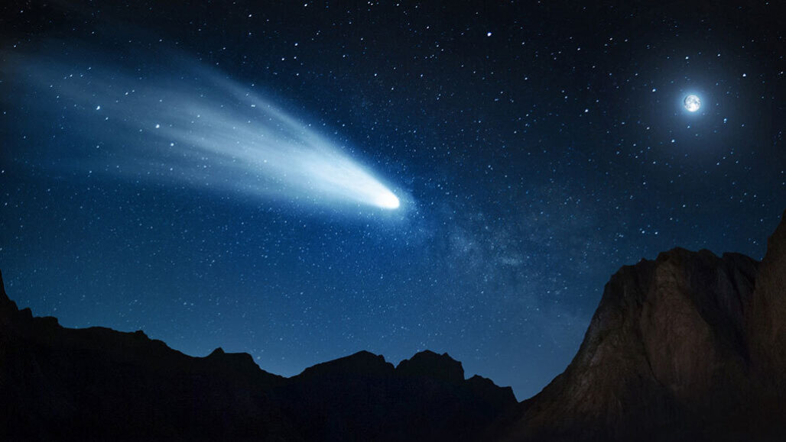

# In a first, astronomers spotted a space rock turning into a comet.
## The process won’t be complete until 2063

Like the mythical half-human, half-horse creatures, centaurs in the solar system are hybrids between asteroids and comets. Now, astronomers have caught one morphing from one type of space rock to the other, potentially giving scientists an unprecedented chance to watch a comet form in real time in the decades to come.

*“We have an opportunity here to see the birth of a comet as it starts to become active,”* says planetary scientist Kat Volk of the University of Arizona in Tucson.

The object, called P/2019 LD2, was discovered by the ATLAS telescope in Hawaii in May. Its orbit suggests that it’s a centaur, a class of rocky and icy objects with unstable orbits. Because of that mixed composition and potential to move around the solar system, astronomers have long suspected that centaurs are a missing link between small icy bodies in the Kuiper Belt beyond Neptune and comets that regularly visit the inner solar system (SN: 11/19/94).

These “short-period” comets, which are thought to originate from icy objects in the Kuiper Belt, orbit the sun once a decade or so, and make repeat appearances in Earth’s skies. (Long-period comets, like Halley’s Comet, which visits the inner solar system once a century, probably originate even farther from the sun, in the Oort cloud (SN: 10/25/13).)

All previously found short-period comets were spotted only after they had transitioned into comets (SN: 8/6/14). But LD2 just came in from the Kuiper Belt recently and will become a comet in as little as 43 years, Volk and colleagues report August 10 at arXiv.org.

*“It’s weird to think that this object should be becoming a comet when I’m retiring,”* Volk says.

After hearing about LD2, Volk, Sarid and their colleagues simulated thousands of possible trajectories to see where the object had been and where it is going. LD2’s orbit probably took it near Saturn around 1850, and it entered its current orbit past Jupiter after a close encounter with the gas giant in 2017, the team found. The object will leave its present orbit and move in toward the sun in 2063, where heat from the sun will probably sublimate LD2’s volatile elements, giving it a bright cometary tail, the researchers say.

*“This will be the first ever comet that we know its history, because we’ve seen it before being a comet,”* Sarid says.

The fact that LD2 is fairly new to the inner reaches of the solar system suggests that it’s made of relatively pristine material that has been in the back of the solar system’s freezer for billions of years, unaltered by heat from the sun. That would make it a time capsule of the early solar system. Studying its composition could help planetary scientists learn what the first planets were made of.

The orbital analysis looks *“very reasonable,”* says Henry Hsieh, a planetary astronomer with the Planetary Science Institute who is based in Honolulu and was not involved in the study. But studying just one transition object is not enough to open the solar system time capsule.

Sarid and colleagues think LD2 could be a good target for a spacecraft to visit. NASA has considered sending spacecraft to centaurs, although no missions have been selected for development yet. But considering that LD2 will become a comet in just a few decades, scientists don’t have much time to plan, build and launch a mission to visit it. *“The windows are closing,”* Sarid says. *“We really need to be doing this now.”*
